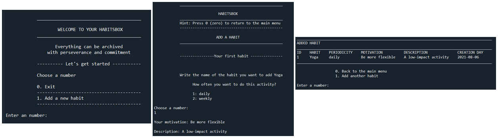
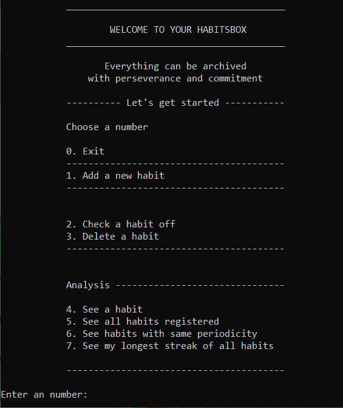

# Habitsbox Application

## Description

The Habitsbox Application allows users to create and track their daily and weekly habits by recording the time and date they are marked as done. It provides an analysis of the recorded habits.

## Table of contents
* [Screenshots](#Screenshots)
* [Features](#Features)
* [Prerequisites](#Prerequisites)
* [Dependencies](#Dependencies)
* [Installation](#Installation)
* [](#)

## Screenshots
**First habit**


## Features

## Prerequisites
* Python version 3.7  
## Dependencies  
* PyInputPlus

## Installation

**Step 1: Install python**  

The application is built using Python version 3.7. Before start using the application, it is neccesary to [install Python](https://www.python.org/downloads/) . 

**Step 2: Download the source code**  

Clone or download the source code from ``git``. To clone the source code repository, open the command line interpreter, navigate to the desired folder, the run:
```
git clone https://github.com/aijimenez/Application.git
```

**Step 3: Install dependencies**  

Use ``pip`` to install PyInputPlus
```
pip install pyinputplus
```
On macOS and Linux
```
pip3 install pyinputplus
```

**Step 4: Run the application**  

1. Navigate to the directory ``Application``
```
cd Application\Habitsbox_app
```
2. Run
```
python menu.py
```

3. Result image  

The Habitsbox application includes five predefined habits. Three of them are daily and two are weekly. Each habit has tracking data for a four-week period.





## Links

