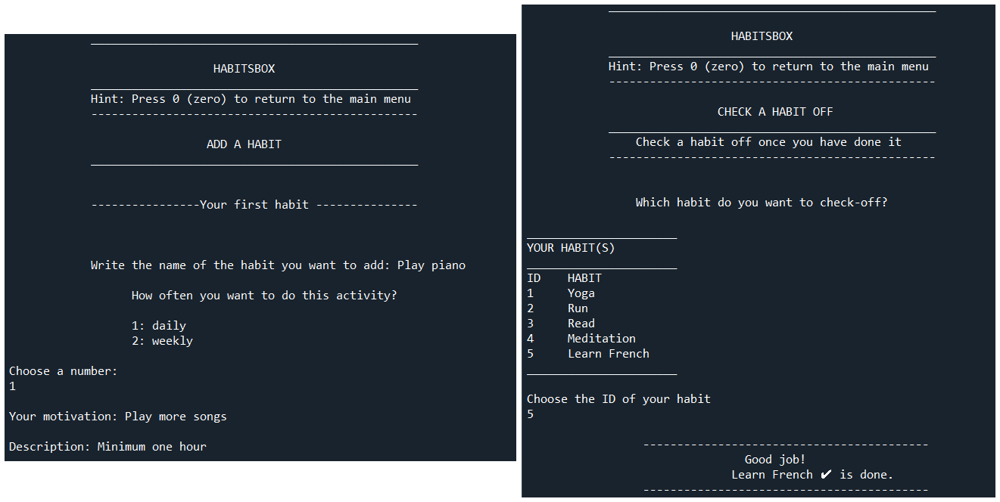
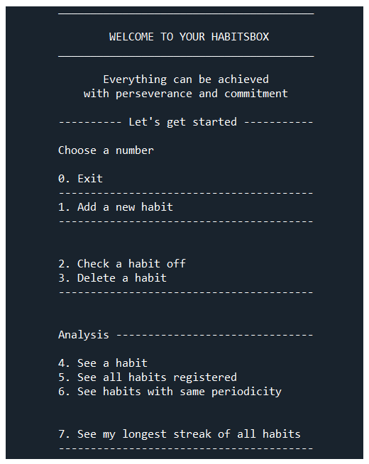
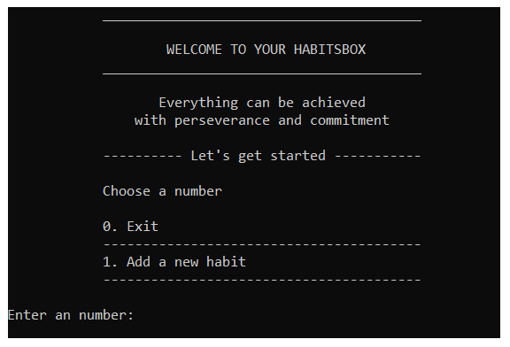

# Habitsbox Application

## Description

The Habitsbox Application allows users to create and track their daily and weekly habits by recording the time and date they are marked as done. It provides an analysis of the recorded habits.

## Table of contents
* [Screenshots](#Screenshots)
* [Features](#Features)
* [Prerequisites](#Prerequisites)
* [Dependencies](#Dependencies)
* [Installation](#Installation)
* [Using the application](#Using the application)
* [Documentation](#Documentation)
* [Testing](#Testing)
* [Links](#Links)
* [](#)

## Screenshots




## Features

* Creation and deletion of habits
* Two different periodicities; daily and weekly
* Individual habit information
* Information on all recorded habits divided by tracked und untracked habits
* Information on habits by periodicity
* Counting days or weeks of activity according to periodicity
* Longest streak for each tracked habit
* Longest streak of all tracked habits
* Part of the day when the habit is performed most of the time

## Prerequisites
* Python version 3.7  
## Dependencies  
* PyInputPlus

## Installation

**Step 1: Install python**  

The application is built using Python version 3.7. Before start using the application, it is neccesary to [install Python](https://www.python.org/downloads/) . 

**Step 2: Download the source code**  

Clone or download the source code from ``git``. To clone the source code repository, open the command line interpreter, navigate to the desired folder, the run:
```
git clone https://github.com/aijimenez/Application.git
```

**Step 3: Install dependencies**  

Use ``pip`` to install PyInputPlus
```
pip install pyinputplus
```
On macOS and Linux
```
pip3 install pyinputplus
```

**Step 4: Run the application**  

1. Navigate to the directory ``Application``
```
cd Application\Habitsbox_app
```
2. Run
```
python menu.py
```

3. Result image  

The Habitsbox application includes five predefined habits. Three of them are daily and two are weekly. Each habit has tracking data for a four-week period.



**Step 5: Exit the application**

To exit the application you must press the number zero once if you are in the main menu, twice if you are using any of the menu options.

## Using the application

**Optional Step: Delete the five default habits**

To use the application without the five default habits

1. Navigate to the directory ``Application``
```
cd Application\Habitsbox_app
```
2. Delete all predefined habits before running the application

```
del DB_Habitsbox_app.db
```
3. Run the application
```
python menu.py
```
4. First image

Once the predefined habits have been deleted, this will be the first image.



**Step 1: Create a habit**

1. Choose the option ``Add a new habit`` with the number 1.

2. Write the name of your habit, choose the frecuency, write your motivation and a short description of the habit.

3. At the end of your habit registration there will be a confirmation.


**Step 2: Check a habit off**


## Documentation  

The documentation for the application was generated using ``pydoc`` and can be found at Application\docs. 

## Testing

The application was tested with Pytest version 6.2, the tests can be found in Application\tests. To run the tests, follow the instructions below.  

**Step 1: Install Pytest**

Use ``pip`` to install PyInputPlus
```
pip install pytest==6.2
```

**Step 2: Run the tests**   

1. Navigate to the directory ``Application``
```
cd Application
```
If you already run the application and you are in ``Habitsbox_app`` directory, go back to the ``Application`` directory

```
cd ..
```
2. Run the tests
```
pytest
```
## Links